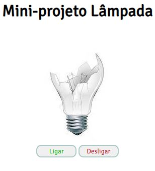

# Mini-projeto Lâmpada

> Explorer

Projeto construído para reforçar os conhecimentos adquiridos em Javascript!

[ 🔗 Clique aqui para acessar](https://mini-projeto-lampada.vercel.app/)

## 🚀 Tecnologias

- HTML
- CSS
- Javascript
- Git e Github

## 💻 Projeto

O Mini-projeto Lâmpada simula um interruptor com um botão que apaga e outro que acende a luz, e com um duplo clique a lâmpada é quebrada.

# 💛 Contato

Email: jonhy.willy.jw71@gmail.com  
Linkedin: https://www.linkedin.com/in/jonhy-willy-57b1051a4/

Feito com ♥ by Jonhy
